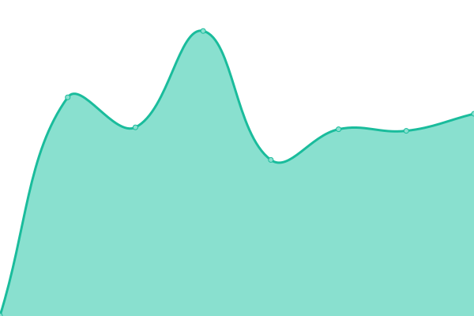

# [📈 Live-Status](https://status.lerncampus24.de): <!--live status--> **Teilausfall**

This repository contains the open-source uptime monitor and status page for [Hexer](https://status.lerncampus24.de), powered by [Upptime](https://github.com/upptime/upptime).

With [Upptime](https://upptime.js.org), you can get your own unlimited and free uptime monitor and status page, powered entirely by a GitHub repository. We use [Issues](https://github.com/BinHexer/lerncampus24-status/issues) as incident reports, [Actions](https://github.com/BinHexer/lerncampus24-status/actions) as uptime monitors, and [Pages](https://status.lerncampus24.de) for the status page.

## [📈 Live Status](https://demo.upptime.js.org): <!--live status--> **Teilausfall**

<!--start: status pages-->
<!-- This summary is generated by Upptime (https://github.com/upptime/upptime) -->
<!-- Do not edit this manually, your changes will be overwritten -->
<!-- prettier-ignore -->
| URL | Status | History | Response Time | Uptime |
| --- | ------ | ------- | ------------- | ------ |
|  [API](https://api.lerncampus24.de/health) | 🟩 Up | [api.yml](https://github.com/BinHexer/lerncampus24-status/commits/HEAD/history/api.yml) | 

 527ms
     
 | 

<a href="https://status.lerncampus24.de/history/api">100.00%</a>
    

|  [Web App](https://app.lerncampus24.de) | 🟥 Down | [web-app.yml](https://github.com/BinHexer/lerncampus24-status/commits/HEAD/history/web-app.yml) | 

 202ms
     
 | 

<a href="https://status.lerncampus24.de/history/web-app">100.00%</a>
    

|  [Webseite](https://lerncampus24.de) | 🟩 Up | [webseite.yml](https://github.com/BinHexer/lerncampus24-status/commits/HEAD/history/webseite.yml) | 

 223ms
     
 | 

<a href="https://status.lerncampus24.de/history/webseite">100.00%</a>
    

<!--end: status pages-->

[**Visit our status website →**](https://status.lerncampus24.de)

## 📄 License

- Powered by: [Upptime](https://github.com/upptime/upptime)
- Code: [MIT](./LICENSE) © [Anand Chowdhary](https://anandchowdhary.com), supported by [Pabio](https://pabio.com)
- Data in the `./history` directory: [Open Database License](https://opendatacommons.org/licenses/odbl/1-0/)
